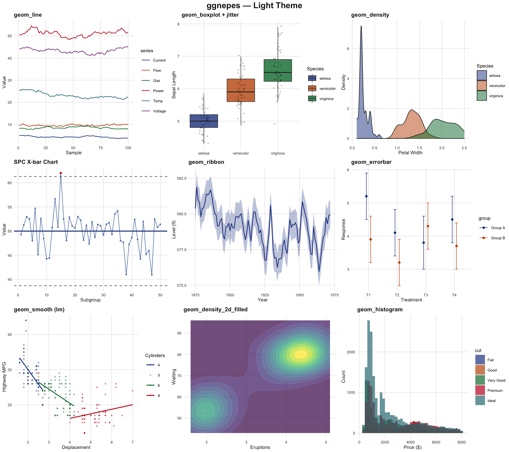
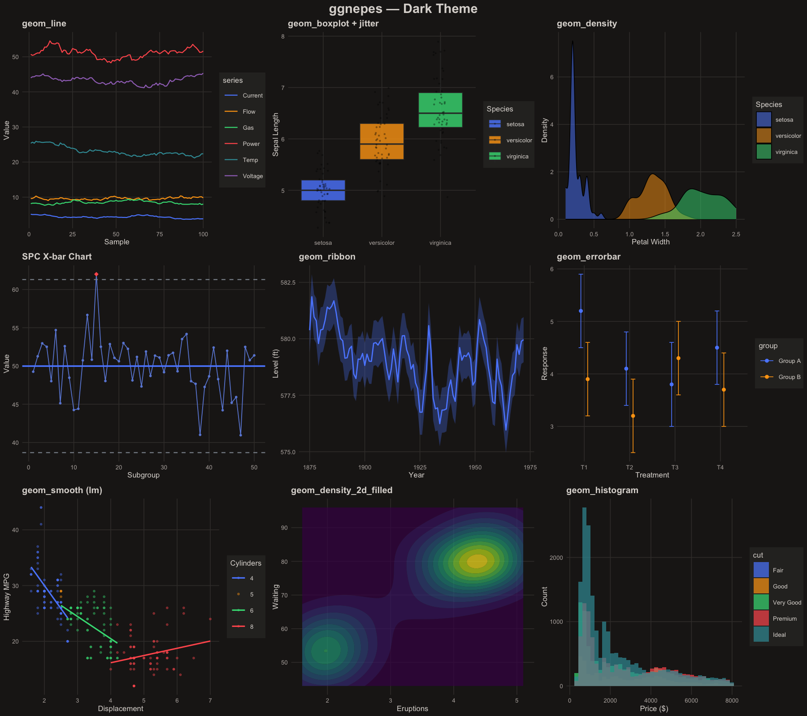

#+TITLE: ggnepes — Nepes Color Palette for ggplot2
#+AUTHOR: Kay Park

Corporate color palette and themes for =ggplot2=, derived from the Nepes brand identity.
WCAG AA accessible + colorblind-safe. Light theme default.

* Screenshots

** Light Theme

** Dark Theme

/9 chart types: geom_line, boxplot+jitter, density, SPC, ribbon, errorbar, smooth, density_2d_filled, histogram/

* All 53 ggplot2 Geom Showcase

=inst/examples/geom53-showcase.R= demonstrates every =geom_*= function in ggplot2 (53 functions, 50 unique — 3 are aliases) with the Nepes palette applied. Generates one chart per page for both dark and light themes.

#+begin_src sh
cd ggnepes && Rscript inst/examples/geom53-showcase.R
# Output: geom53-dark.pdf, geom53-light.pdf
#+end_src

** Chart List

| #     | Geom                       | Category            | Data Source       |
|-------+----------------------------+---------------------+-------------------|
| 1     | =geom_point=               | Scatter & Points    | iris              |
| 2     | =geom_jitter=              | Scatter & Points    | iris              |
| 3     | =geom_count=               | Scatter & Points    | mpg               |
| 4     | =geom_rug=                 | Scatter & Points    | iris              |
| 5     | =geom_boxplot=             | Box / Violin / Dot  | iris              |
| 6     | =geom_violin=              | Box / Violin / Dot  | iris              |
| 7     | =geom_dotplot=             | Box / Violin / Dot  | iris              |
| 8     | =geom_bar=                 | Bars & Columns      | mpg               |
| 9     | =geom_col=                 | Bars & Columns      | synthetic         |
| 10    | =geom_histogram=           | Bars & Columns      | diamonds          |
| 11    | =geom_freqpoly=            | Bars & Columns      | diamonds          |
| 12    | =geom_density=             | Bars & Columns      | iris              |
| 13    | =geom_line=                | Lines & Paths       | synthetic         |
| 14    | =geom_step=                | Lines & Paths       | synthetic         |
| 15    | =geom_path=                | Lines & Paths       | synthetic         |
| 16-17 | =geom_area=                | Lines & Paths       | synthetic         |
| 18    | =geom_hline=               | Reference Lines     | mpg               |
| 19    | =geom_vline=               | Reference Lines     | mpg               |
| 20    | =geom_abline=              | Reference Lines     | mpg               |
| 21    | =geom_segment=             | Reference Lines     | synthetic         |
| 22    | =geom_curve=               | Reference Lines     | synthetic         |
| 23    | =geom_spoke=               | Reference Lines     | synthetic         |
| 24    | =geom_rect=                | Rectangles & Shapes | synthetic         |
| 25    | =geom_tile=                | Rectangles & Shapes | synthetic         |
| 26    | =geom_polygon=             | Rectangles & Shapes | synthetic         |
| 27    | =geom_text=                | Text & Labels       | mtcars            |
| 28    | =geom_label=               | Text & Labels       | mtcars            |
| 29-30 | =geom_smooth=              | Smoothing & Fitting | mpg               |
| 31    | =geom_quantile=            | Smoothing & Fitting | mpg               |
| 32    | =geom_linerange=           | Error / Uncertainty | synthetic         |
| 33    | =geom_pointrange=          | Error / Uncertainty | synthetic         |
| 34    | =geom_crossbar=            | Error / Uncertainty | synthetic         |
| 35    | =geom_errorbar=            | Error / Uncertainty | synthetic         |
| 36    | =geom_errorbarh=           | Error / Uncertainty | synthetic         |
| 37    | =geom_ribbon=              | Error / Uncertainty | LakeHuron         |
| 38    | =geom_density_2d=          | 2D Density          | faithful          |
| 39    | =geom_density_2d_filled=   | 2D Density          | faithful          |
| 40    | =geom_contour=             | 2D Density          | synthetic         |
| 41    | =geom_contour_filled=      | 2D Density          | synthetic         |
| 42    | =geom_bin_2d=              | 2D Binning          | diamonds          |
| 43    | =geom_hex=                 | 2D Binning          | diamonds          |
| 44    | =geom_raster=              | 2D Binning          | synthetic         |
| 45    | =geom_map=                 | Maps & Spatial      | US states         |
| 46    | =geom_polygon= (map)       | Maps & Spatial      | US states         |
| 47    | =geom_sf=                  | Maps & Spatial      | NC counties (sf)  |
| 48    | =geom_sf_text=             | Maps & Spatial      | NC counties (sf)  |
| 49    | =geom_sf_label=            | Maps & Spatial      | NC counties (sf)  |
| 50-51 | =geom_qq= + =geom_qq_line= | Statistical         | synthetic (t-dist) |
| 52    | =geom_function=            | Statistical         | synthetic         |
| 53    | =geom_blank=               | Utility             | iris              |
| Bonus | SPC X-bar Control Chart    | Composite           | synthetic         |

3 alias pairs (same function): =geom_density2d= / =geom_density_2d=, =geom_density2d_filled= / =geom_density_2d_filled=, =geom_bin2d= / =geom_bin_2d=.

Based on [[https://youtu.be/ZrkjRwsnj6Y][ALL 53 ggplot2 GEOMS shown in R]] by The Data Digest.

** Optional Dependencies

#+begin_src sh
# Required for geom_sf/sf_text/sf_label:
sudo port install gdal proj9 udunits2 abseil
PKG_CONFIG_PATH=/opt/local/lib/proj9/lib/pkgconfig:/opt/local/lib/pkgconfig \
  Rscript -e 'install.packages(c("units", "s2", "sf"),
    configure.args = c(
      units = "--with-udunits2-lib=/opt/local/lib --with-udunits2-include=/opt/local/include/udunits2",
      sf = "--with-proj-lib=/opt/local/lib/proj9/lib --with-proj-include=/opt/local/lib/proj9/include --with-gdal-config=/opt/local/bin/gdal-config"
    ))'

# Required for geom_hex:
Rscript -e 'install.packages("hexbin")'

# Required for geom_quantile:
Rscript -e 'install.packages("quantreg")'

# Required for geom_map:
Rscript -e 'install.packages("maps")'
#+end_src

* Installation

#+begin_src r
devtools::install_github("kayspark/ggnepes")
#+end_src

* Usage

#+begin_src r
library(ggnepes)

# Color scale (light default)
ggplot(data, aes(x, y, color = group)) +
  geom_line() +
  scale_color_nepes() +
  theme_nepes_light()

# Dark theme
ggplot(data, aes(x, y, fill = group)) +
  geom_col() +
  scale_fill_nepes(theme = "dark") +
  theme_nepes_dark()

# SPC control chart colors
spc <- nepes_spc()
# Returns: center_line, data_points, control_limit, spec_limit, violation
#+end_src

* Palette

| # | Name   | Light Hex | Dark Hex  |
|---+--------+-----------+-----------|
| 1 | Blue   | =#23438E= | =#5C8CFF= |
| 2 | Orange | =#C25609= | =#FEA413= |
| 3 | Green  | =#017939= | =#3DDC84= |
| 4 | Red    | =#C4181F= | =#FF5C5C= |
| 5 | Teal   | =#2D7A82= | =#3A9BA5= |
| 6 | Purple | =#873D8E= | =#A274C3= |

Plus 6 midtone variants for 12-color charts.

* API

- =nepes_pal(theme, n)= — color vector (default: light, 12 colors)
- =nepes_spc(theme)= — named SPC palette (center_line, data_points, control_limit, spec_limit, violation)
- =scale_color_nepes(theme)= / =scale_fill_nepes(theme)= — ggplot2 discrete scales
- =theme_nepes_light()= / =theme_nepes_dark()= — complete ggplot2 themes

* Related

- [[https://github.com/kayspark/nepes-palette][nepes-palette]] — single source of truth for all Nepes themes
- [[https://github.com/kayspark/mplstyle-nepes][mplstyle-nepes]] — Python/matplotlib equivalent of this R package
- [[https://github.com/kayspark/nepes-palette/blob/master/docs/chart-palette-validated.md][docs/chart-palette-validated.md]] — WCAG + colorblind validation report for the chart palette
